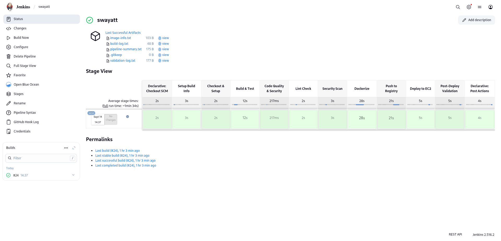
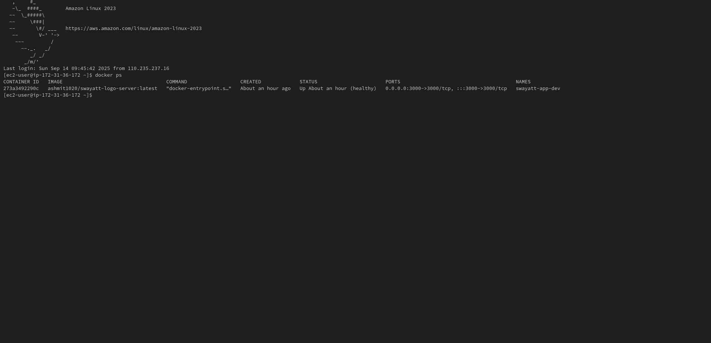
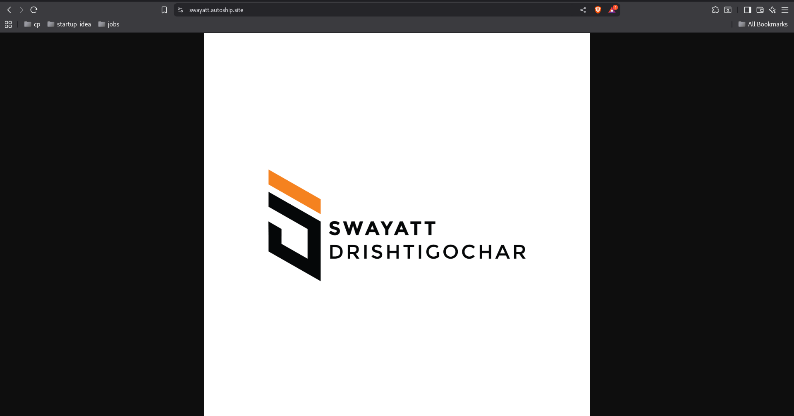

# Swayatt Logo Server - DevOps CI/CD Project

<div align="center">
  
</div>


A complete DevOps implementation showcasing CI/CD pipeline automation using Jenkins, Docker, and cloud deployment for a simple Node.js logo server application.

## 🌐 Live Application

**Backend URL**: [https://swayatt.autoship.site](https://swayatt.autoship.site)

The application serves the Swayatt logo and provides a health check endpoint.

## 📋 Table of Contents

- [Project Overview](#project-overview)
- [Architecture](#architecture)
- [Features](#features)
- [Technology Stack](#technology-stack)
- [Project Structure](#project-structure)
- [Setup & Installation](#setup--installation)
- [CI/CD Pipeline](#cicd-pipeline)
- [Docker Configuration](#docker-configuration)
- [Deployment](#deployment)
- [API Endpoints](#api-endpoints)
- [Monitoring & Validation](#monitoring--validation)
- [Security](#security)
- [Troubleshooting](#troubleshooting)

## 🎯 Project Overview

This project demonstrates modern DevOps practices by implementing a complete CI/CD pipeline for a simple Node.js application. The application serves a static logo image and includes comprehensive automation for building, testing, dockerization, and deployment.

### Key Objectives
- ✅ Automated CI/CD pipeline with Jenkins
- ✅ Containerized deployment with Docker
- ✅ Cloud-based hosting and deployment
- ✅ Comprehensive testing and validation
- ✅ Security best practices implementation
- ✅ **AWS CloudWatch monitoring and logging**

## 🏗️ Architecture

```
┌─────────────────┐    ┌──────────────────┐    ┌─────────────────┐
│                 │    │                  │    │                 │
│   GitHub Repo   │───▶│  Jenkins CI/CD   │───▶│  Docker Registry│
│                 │    │                  │    │   (DockerHub)   │
└─────────────────┘    └──────────────────┘    └─────────────────┘
                                │                         │
                                ▼                         │
                       ┌──────────────────┐               │
                       │                  │               │
                       │   Build & Test   │               │
                       │                  │               │
                       └──────────────────┘               │
                                │                         │
                                ▼                         ▼
                       ┌──────────────────┐    ┌─────────────────┐
                       │                  │    │                 │
                       │   Dockerization  │───▶│  Cloud Deploy   │
                       │                  │    │ (swayatt.auto   │
                       └──────────────────┘    │  ship.site)     │
                                               └─────────────────┘
                                                        │
                                                        ▼
                                               ┌─────────────────┐
                                               │                 │
                                               │ AWS CloudWatch  │
                                               │ Monitoring &    │
                                               │ Logging         │
                                               └─────────────────┘
```

## ✨ Features

- **Simple Logo Server**: Serves Swayatt logo via HTTP endpoint
- **Health Check Endpoint**: Application monitoring and status verification
- **Automated CI/CD**: Complete pipeline automation with Jenkins
- **Docker Containerization**: Optimized multi-stage Docker builds
- **Security Hardening**: Non-root user, minimal attack surface
- **Automated Testing**: Build verification and health checks
- **Cloud Deployment**: Live deployment at swayatt.autoship.site
- **Comprehensive Logging**: Build logs, deployment logs, and validation reports

## 🛠️ Technology Stack

### Core Application
- **Runtime**: Node.js 18.x (Alpine Linux)
- **Framework**: Express.js 4.18.2
- **Language**: JavaScript (ES6+)

### DevOps Tools
- **CI/CD**: Jenkins with declarative pipelines
- **Containerization**: Docker with multi-stage builds
- **Registry**: DockerHub (ashmit1020/swayatt-logo-server)
- **Version Control**: Git & GitHub
- **Cloud Platform**: AWS EC2 / Cloud hosting

### Security & Quality
- **Security Scanning**: npm audit integration
- **Code Quality**: ESLint-style validation
- **Container Security**: Non-root user, minimal base image
- **Credential Management**: Jenkins credentials store

## 📁 Project Structure

```
Swayatt/
├── README.md                          # Project documentation
├── Task.md                           # Original assignment requirements
├── .gitignore                        # Git ignore rules
│
├── app/                              # Application source code
│   ├── app.js                        # Main Express.js server
│   ├── package.json                  # Node.js dependencies
│   ├── package-lock.json            # Dependency lock file
│   ├── logoswayatt.png              # Static logo asset
│   ├── README.md                     # App-specific documentation
│   └── .gitignore                    # App-level ignore rules
│
├── cicd/                             # CI/CD configuration
│   ├── Jenkinsfile                   # Jenkins pipeline definition
│   └── docker/
│       └── dockerfile                # Multi-stage Docker build
│
└── deployment-proof/                 # Deployment artifacts
    ├── screenshots/                  # Deployment screenshots
    └── logs/                         # Build and deployment logs
```

## 🚀 Setup & Installation

### Prerequisites
- Node.js 18.x or higher
- Docker & Docker Compose
- Jenkins (for CI/CD)
- Git

### Local Development Setup

1. **Clone the repository**
   ```bash
   git clone https://github.com/Ashmit-Kumar/Swayatt.git
   cd Swayatt
   ```

2. **Install dependencies**
   ```bash
   cd app
   npm install
   ```

3. **Run the application**
   ```bash
   npm start
   ```
   The server will start at `http://localhost:3000`

### Docker Setup

1. **Build the Docker image**
   ```bash
   docker build -f cicd/docker/dockerfile -t swayatt-logo-server .
   ```

2. **Run the container**
   ```bash
   docker run -d -p 3000:3000 --name swayatt-app swayatt-logo-server
   ```

3. **Verify deployment**
   ```bash
   curl http://localhost:3000/health
   ```

## 🔄 CI/CD Pipeline

The Jenkins pipeline implements a comprehensive 7-stage process:

### Pipeline Stages

1. **Setup Build Info**
   - Git commit hash extraction
   - Build timestamp generation
   - Environment variable setup

2. **Checkout & Setup**
   - Source code checkout
   - Workspace preparation
   - Docker permissions configuration

3. **Build & Test**
   - Dependency installation (`npm install`)
   - Application testing (`npm test`)
   - Basic application validation

4. **Code Quality & Security** (Parallel)
   - **Lint Check**: JavaScript syntax validation
   - **Security Scan**: npm audit for vulnerabilities

5. **Dockerize**
   - Multi-stage Docker image build
   - Container health testing
   - Image tagging and validation

6. **Push to Registry**
   - DockerHub authentication
   - Image push to registry
   - Version management

7. **Deploy & Validation**
   - Local deployment on Jenkins node
   - Health check verification
   - Deployment artifact generation

### Pipeline Features
- **Webhook Triggers**: Automatic builds on GitHub push
- **Parallel Processing**: Concurrent quality checks
- **Error Handling**: Comprehensive failure management
- **Artifact Archiving**: Build logs and deployment proof
- **Environment Management**: Dev/Prod environment support

## 🐳 Docker Configuration

The project uses a security-optimized multi-stage Docker build:

```dockerfile
# Stage 1: Builder (Dependencies)
FROM node:18-alpine AS builder
WORKDIR /app
COPY app/package*.json ./
RUN npm ci --only=production

# Stage 2: Production (Minimal)
FROM node:18-alpine AS production
RUN adduser -S nodeuser -u 1001  # Non-root user
WORKDIR /app
COPY --from=builder /app/node_modules ./node_modules
COPY app/ ./
USER nodeuser                     # Security: Run as non-root
EXPOSE 3000
HEALTHCHECK --interval=30s CMD wget --spider http://localhost:3000/
CMD ["node", "app.js"]
```

### Security Features
- **Non-root execution**: Runs as `nodeuser` (UID 1001)
- **Minimal attack surface**: Alpine Linux base image
- **Health monitoring**: Built-in container health checks
- **Layer optimization**: Multi-stage build reduces image size

## 🌍 Deployment

### Live Environment
- **URL**: https://swayatt.autoship.site
- **Environment**: Production
- **Container**: Docker-based deployment
- **Monitoring**: Automated health checks

### Deployment Process
1. **Automated Build**: Jenkins triggers on code changes
2. **Testing**: Comprehensive validation pipeline
3. **Dockerization**: Container image creation
4. **Registry Push**: Image upload to DockerHub
5. **Live Deployment**: Container deployment to cloud infrastructure
6. **Validation**: Health checks and endpoint verification

### 📸 Deployment Proof

Visual evidence of successful deployment and CI/CD pipeline execution:

#### Jenkins Pipeline Success


*Successful Jenkins pipeline execution showing all stages completed*

#### Docker Container Running on EC2


*Docker container successfully running on AWS EC2 instance*

#### Live Application Accessible


*Application successfully serving the Swayatt logo at the live URL*

## 🔗 API Endpoints

### Main Endpoints

| Endpoint | Method | Description | Response |
|----------|--------|-------------|----------|
| `/` | GET | Serves Swayatt logo | PNG Image |
| `/health` | GET | Health check | JSON Status |

### Logo Endpoint Preview
The root endpoint (`/`) serves the following logo:

<div align="center">
  
  <br>
  <em>Logo served at the root endpoint</em>
</div>

### Example Usage

```bash
# Get the logo
curl https://swayatt.autoship.site/

# Health check
curl https://swayatt.autoship.site/health
# Response: {"status":"ok"}
```

## 📊 Monitoring & Validation

### AWS CloudWatch Integration
- **Real-time Metrics**: CPU, Memory, Disk I/O, Network monitoring
- **Log Aggregation**: Application logs, Jenkins logs, Docker container logs
- **Custom Dashboard**: Visual monitoring interface with key performance indicators
- **Alerting**: Automated alerts for high CPU, memory usage, and application downtime
- **Log Groups**:
  - `/aws/ec2/swayatt-app/docker` - Application container logs
  - `/aws/ec2/swayatt-app/jenkins` - CI/CD pipeline logs
  - `/aws/ec2/swayatt-app/pipeline` - Build and deployment activity logs

### Build Monitoring
- **Jenkins Dashboard**: Pipeline status and history
- **Build Logs**: Comprehensive logging for each stage
- **Artifact Storage**: Deployment proof and screenshots

### Application Monitoring
- **Health Checks**: Automated endpoint monitoring
- **Container Stats**: Resource usage tracking
- **Log Aggregation**: Centralized logging system

### Accessing CloudWatch Monitoring

#### Via AWS Console
1. Navigate to **CloudWatch** service in AWS Console
2. **Dashboards** → Select "Swayatt-App-Monitoring"
3. **Log groups** → View logs:
   - `/aws/ec2/swayatt-app/docker` - Application container logs
   - `/aws/ec2/swayatt-app/jenkins` - CI/CD pipeline logs
   - `/aws/ec2/swayatt-app/pipeline` - Build activity logs

#### Via AWS CLI
```bash
# View recent application logs
aws logs describe-log-streams --log-group-name "/aws/ec2/swayatt-app/docker"

# Get pipeline logs
aws logs filter-log-events --log-group-name "/aws/ec2/swayatt-app/jenkins" --start-time 1694678400000

# Monitor metrics
aws cloudwatch get-metric-statistics --namespace "Swayatt/App" --metric-name CPUUtilization --start-time 2023-09-14T00:00:00Z --end-time 2023-09-14T23:59:59Z --period 300 --statistics Average
```

### Validation Reports
Located in `deployment-proof/` directory:
- `pipeline-summary.txt`: Build status and metadata
- `validation-log.txt`: Deployment validation results
- `image-info.txt`: Docker image details
- `logs/`: Detailed build and deployment logs
- `monitoring/`: CloudWatch setup and validation logs

## 🔒 Security

### Application Security
- **Input Validation**: Path-based file serving with Express.js
- **Minimal Dependencies**: Only essential packages included
- **No Sensitive Data**: No hardcoded credentials or secrets

### Infrastructure Security
- **Credential Management**: Jenkins credential store
- **Container Security**: Non-root user execution
- **Network Security**: HTTPS-enabled deployment
- **Access Control**: Proper authentication mechanisms

### Security Scanning
- **Dependency Audit**: Automated npm vulnerability scanning
- **Container Scanning**: Docker image security verification
- **Code Quality**: Static analysis and linting

## 🐛 Troubleshooting

### Common Issues

**Application won't start**
```bash
# Check Node.js version
node --version  # Should be 18.x+

# Verify dependencies
npm install
npm audit fix
```

**Docker build failures**
```bash
# Check Docker daemon
sudo systemctl status docker

# Verify Dockerfile syntax
docker build --no-cache -f cicd/docker/dockerfile .
```

**Pipeline failures**
- Check Jenkins credentials configuration
- Verify DockerHub authentication
- Review pipeline logs in Jenkins dashboard

### Debug Commands
```bash
# Check application logs
docker logs swayatt-app-dev

# Verify container health
docker ps | grep swayatt
curl http://localhost:3000/health

# Pipeline artifact access
cat deployment-proof/pipeline-summary.txt
```

## 📈 Future Enhancements

### Planned Improvements
- [ ] Kubernetes deployment manifests
- [ ] Prometheus monitoring integration
- [ ] Automated security scanning with Trivy
- [ ] Blue-green deployment strategy
- [ ] Infrastructure as Code with Terraform
- [ ] Multi-environment support (staging/prod)

### Performance Optimizations
- [ ] CDN integration for static assets
- [ ] Container image size optimization
- [ ] Caching strategy implementation
- [ ] Load balancing configuration

## 📚 Additional Documentation

### Quick Start Guides
- **[Deployment Checklist](DEPLOYMENT_CHECKLIST.md)** - Step-by-step deployment guide
- **[Project Summary](PROJECT_SUMMARY.md)** - Complete implementation overview
- **[Monitoring Guide](docs/MONITORING.md)** - CloudWatch setup and configuration

### Technical Resources
- **[CI/CD Pipeline](cicd/Jenkinsfile)** - Complete Jenkins automation
- **[Docker Configuration](cicd/docker/dockerfile)** - Optimized container build
- **[CloudWatch Setup](cicd/aws/)** - Monitoring configuration and scripts

## 🤝 Contributing

1. Fork the repository
2. Create a feature branch (`git checkout -b feature/amazing-feature`)
3. Commit your changes (`git commit -m 'Add amazing feature'`)
4. Push to the branch (`git push origin feature/amazing-feature`)
5. Open a Pull Request

## 📄 License

This project is created for educational and demonstration purposes as part of a DevOps assignment.

## 👨‍💻 Author

**Ashmit Kumar**
- GitHub: [@Ashmit-Kumar](https://github.com/Ashmit-Kumar)
- Project Repository: [Swayatt DevOps Project](https://github.com/Ashmit-Kumar/Swayatt)

---

## 📞 Support

For support and questions:
- Create an issue in the GitHub repository
- Check the troubleshooting section above
- Review Jenkins pipeline logs for deployment issues

---

**Built using modern DevOps practices and tools**
